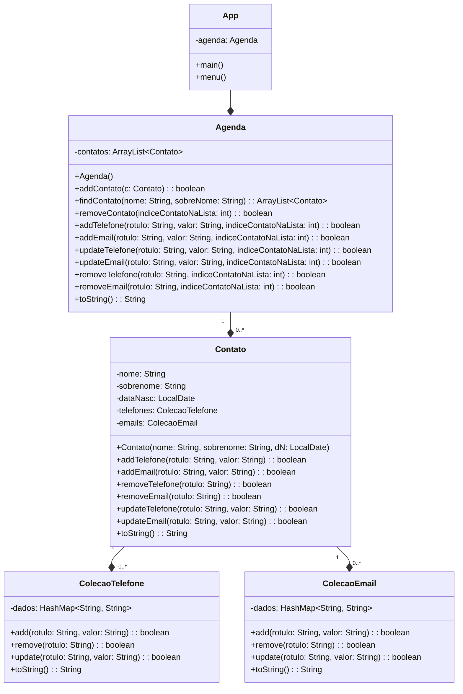

# Agenda Telefonica
Este projeto foi realizado duranto os estudos de programação orientada a objetos com o professor Emerson Mello.

Durante suas atividades em sala, foi passado o objetivo de criar um projeto em Java seguindo este diagrama UML

**OBS: ** Este projeto foi realizado durante a faculdade de ADS no IFSC

