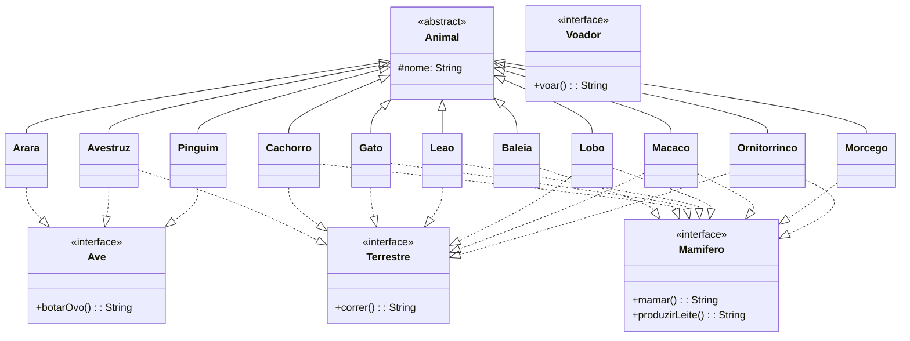

```mermaid
classDiagram
    direction TD
    
    Animal <|-- Arara
    Animal <|-- Avestruz
    Animal <|-- Baleia
    Animal <|-- Cachorro
    Animal <|-- Gato
    Animal <|-- Leao
    Animal <|-- Lobo
    Animal <|-- Macaco
    Animal <|-- Morcego
    Animal <|-- Pinguim
    Animal <|-- Ornitorrinco
    
    Arara ..|> Ave
    Avestruz ..|> Ave
    Pinguim ..|> Ave
    
    Baleia ..|> Mamifero
    Cachorro ..|> Mamifero
    Gato ..|> Mamifero
    Leao ..|> Mamifero
    Lobo ..|> Mamifero
    Macaco ..|> Mamifero
    Morcego ..|> Mamifero
    Ornitorrinco ..|> Mamifero
    
    Avestruz ..|> Terrestre
    Cachorro ..|> Terrestre
    Gato ..|> Terrestre
    Leao ..|> Terrestre
    Lobo ..|> Terrestre
    Macaco ..|> Terrestre
    Ornitorrinco ..|> Terrestre
    
    
   class Animal {
       <<abstract>>
       #nome: String
   }
   
   class Mamifero{
       <<interface>>
       +mamar(): String
       +produzirLeite(): String
   }
    
   class Ave{
        <<interface>>
        +botarOvo(): String
   }
   
   class Terrestre{
       <<interface>>
       +correr(): String
   }
   
   class Voador{
       <<interface>>
       +voar(): String
   }
   
   class Arara{
       
   }
   
   class Avestruz{
       
   }
   
    class Baleia{
        
    }
    
    class Cachorro{
        
    }
    
    class Gato{
        
    }
    
    class Leao{
        
    }
    
    class  Lobo{
        
    }
    
    class Macaco{
        
    }
    
    class Morcego{
        
    }
    
    class Pinguim{
        
    }
    
    class Ornitorrinco{
        
    }
    
```
