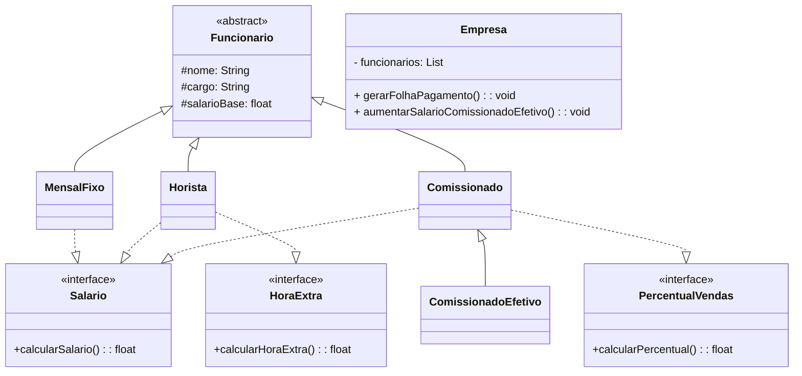

```mermaid
classDiagram
    direction TD
    
    Funcionario <|-- MensalFixo
    Funcionario <|-- Horista
    Funcionario <|-- Comissionado
    Comissionado <|-- ComissionadoEfetivo
    
    MensalFixo ..|> Salario
    Horista ..|> Salario
    Horista ..|> HoraExtra
    Comissionado ..|> Salario
    Comissionado ..|> PercentualVendas    
    
    
   class Funcionario {
       <<abstract>>
       #nome: String
       #cargo: String
       #salarioBase: float
   }
   
   class Salario{
       <<interface>>
       +calcularSalario(): float
   }

    class PercentualVendas{
        <<interface>>
        +calcularPercentual(): float
    }

    class HoraExtra{
        <<interface>>
        +calcularHoraExtra(): float
    }
   
   class MensalFixo{
       
   }
   
   class Horista{
       
   }
   
    class Comissionado{
        
    }
    
    class ComissionadoEfetivo{
        
    }

    class Empresa {
        - funcionarios: List<Calculavel>
        + gerarFolhaPagamento(): void
        + aumentarSalarioComissionadoEfetivo(): void
    }
```
