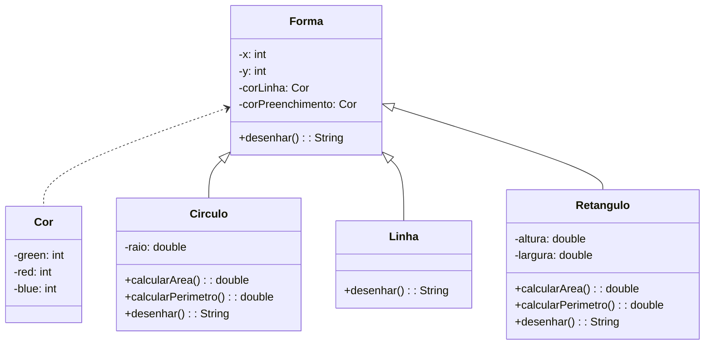

```mermaid
classDiagram
    direction TD
    
    Forma <.. Cor
    Forma <|-- Circulo
    Forma <|-- Linha
    Forma <|-- Retangulo
    

    
    class Forma {
        -x: int
        -y: int
        -corLinha: Cor
        -corPreenchimento: Cor
        +desenhar(): String
    }

    class Cor {
        -green: int
        -red: int
        -blue: int
    }
    
    class Linha{
        +desenhar(): String
    }
    
    class Circulo{
        -raio: double
        +calcularArea(): double
        +calcularPerimetro(): double
        +desenhar(): String
    }
    
    class Retangulo{
        -altura: double
        -largura: double
        +calcularArea(): double
        +calcularPerimetro(): double
        +desenhar(): String
    }
```