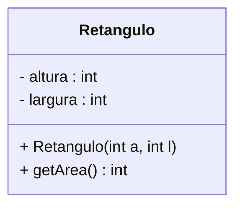
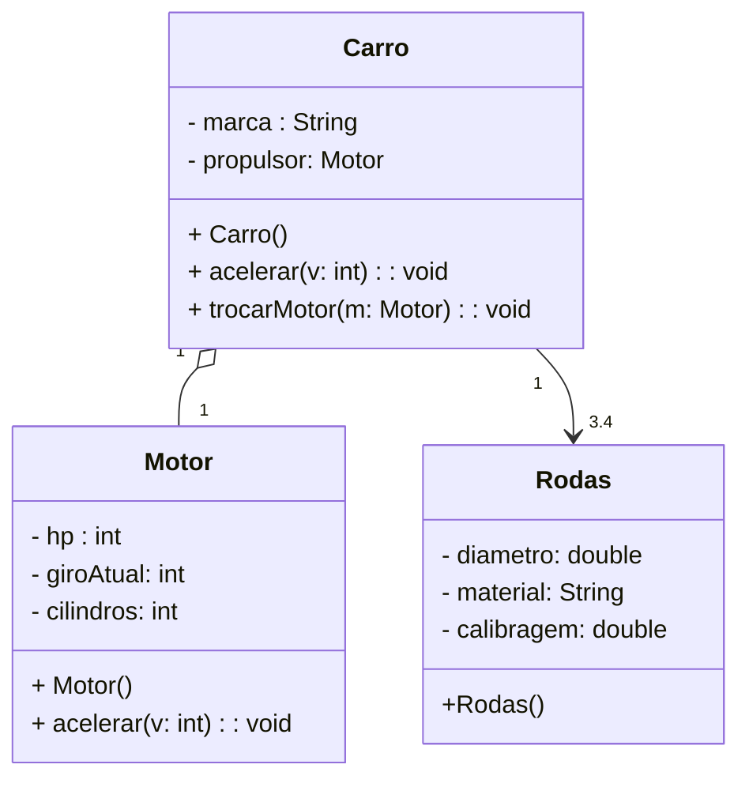
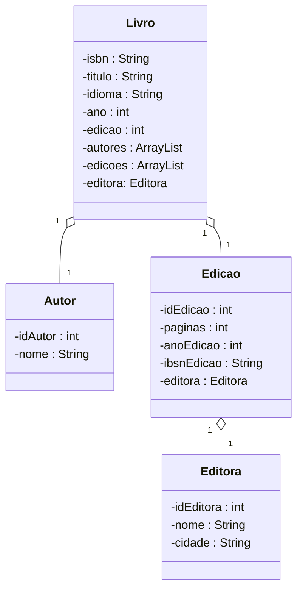

```mermaid
    classDiagram
        direction LR
        
        class Retangulo{
            - altura : int
            - largura : int
            + Retangulo(int a, int l)
            + getArea() int
        }
```

```mermaid
    classDiagram
        
        class Carro{
            - marca : String
            - propulsor: Motor
            + Carro() 
            + acelerar(v: int): void
            + trocarMotor(m: Motor): void
            }
            
        class Motor{
            - hp : int
            - giroAtual: int
            - cilindros: int
            + Motor() 
            + acelerar(v: int): void
            }
            
            class Rodas{
         - diametro: double
         - material: String
         - calibragem: double
         +Rodas()
            }
            Carro"1" o-- "1"Motor
            Carro"1" --> "3.4"Rodas
```

```mermaid
    classDiagram
        
        class Livro{
            -isbn : String
            -titulo : String
            -idioma : String
            -ano : int
            -edicao : int
            -autores : ArrayList<Autor>
            -edicoes : ArrayList<Edicao>
            -editora: Editora
            }
            
        class Editora{
            -idEditora : int
            -nome : String
            -cidade : String
            }
            
            class Autor {
                -idAutor : int
                -nome : String
            }
            
            class Edicao{
                -idEdicao : int
                -paginas : int
                -anoEdicao : int
                -ibsnEdicao : String
                -editora : Editora
            }
            
            Edicao"1" o-- "1"Editora
            Livro"1" o-- "1"Edicao
            Livro"1" o-- "1"Autor
            
            
```
