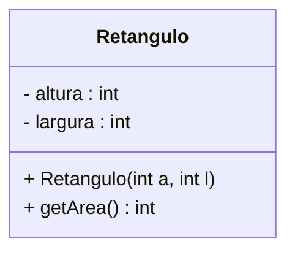
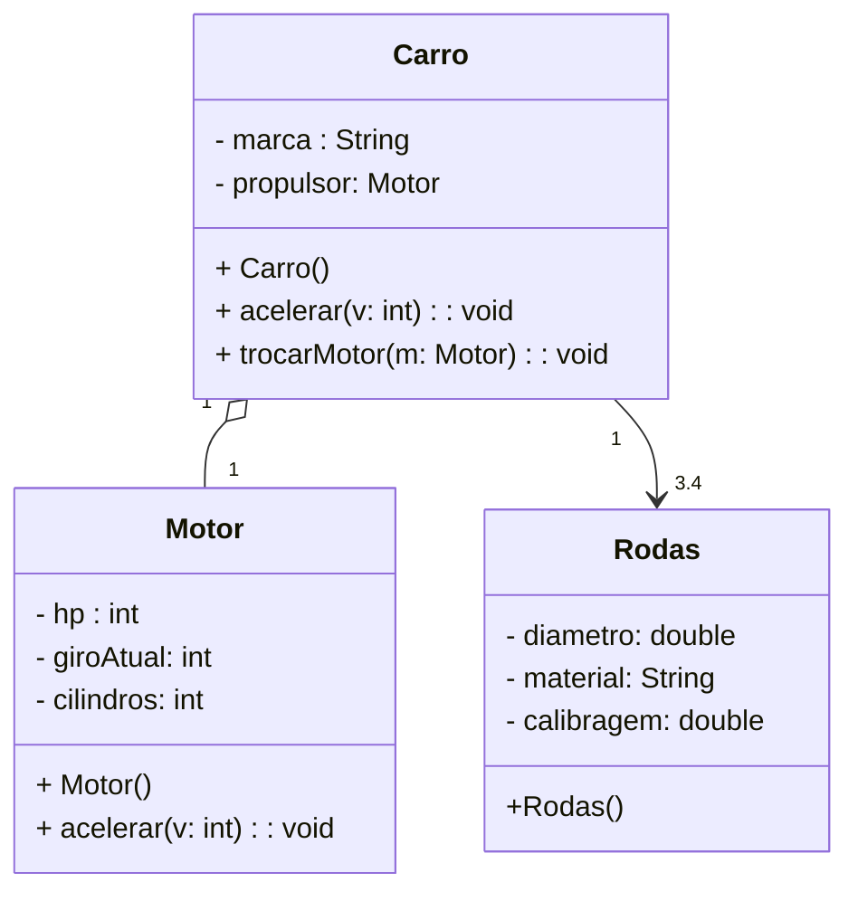
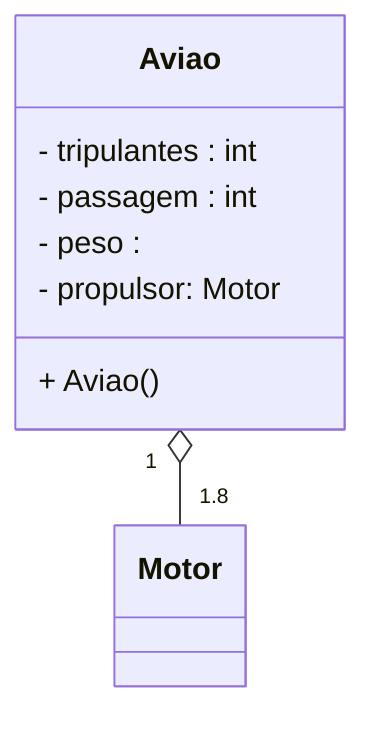

```mermaid
    classDiagram
        direction LR
        
        class Retangulo{
            - altura : int
            - largura : int
            + Retangulo(int a, int l)
            + getArea() int
        }
```

```mermaid
    classDiagram
        
        class Carro{
            - marca : String
            - propulsor: Motor
            + Carro() 
            + acelerar(v: int): void
            + trocarMotor(m: Motor): void
            }
            
        class Motor{
            - hp : int
            - giroAtual: int
            - cilindros: int
            + Motor() 
            + acelerar(v: int): void
            }
            
            class Rodas{
         - diametro: double
         - material: String
         - calibragem: double
         +Rodas()
            }
            Carro"1" o-- "1"Motor
            Carro"1" --> "3.4"Rodas
```

```mermaid
    classDiagram
        
        class Aviao{
            - tripulantes : int
            - passagem : int
            - peso : 
            - propulsor: Motor
            + Aviao() 
         
            }
            
        class Motor{
            
            }
            
            Aviao"1" o-- "1.8"Motor
            
```
