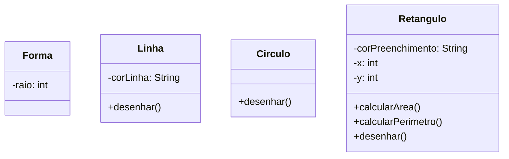

```mermaid
classDiagram
    direction TD
    
    
    class Forma {
        -raio: int
    }
    
    class Linha{
        -corLinha: String
        +desenhar()
    }
    
    class Circulo{
        +desenhar()
    }
    
    class Retangulo{
        -corPreenchimento: String
        -x: int
        -y: int
        +calcularArea()
        +calcularPerimetro()
        +desenhar()
    }
```