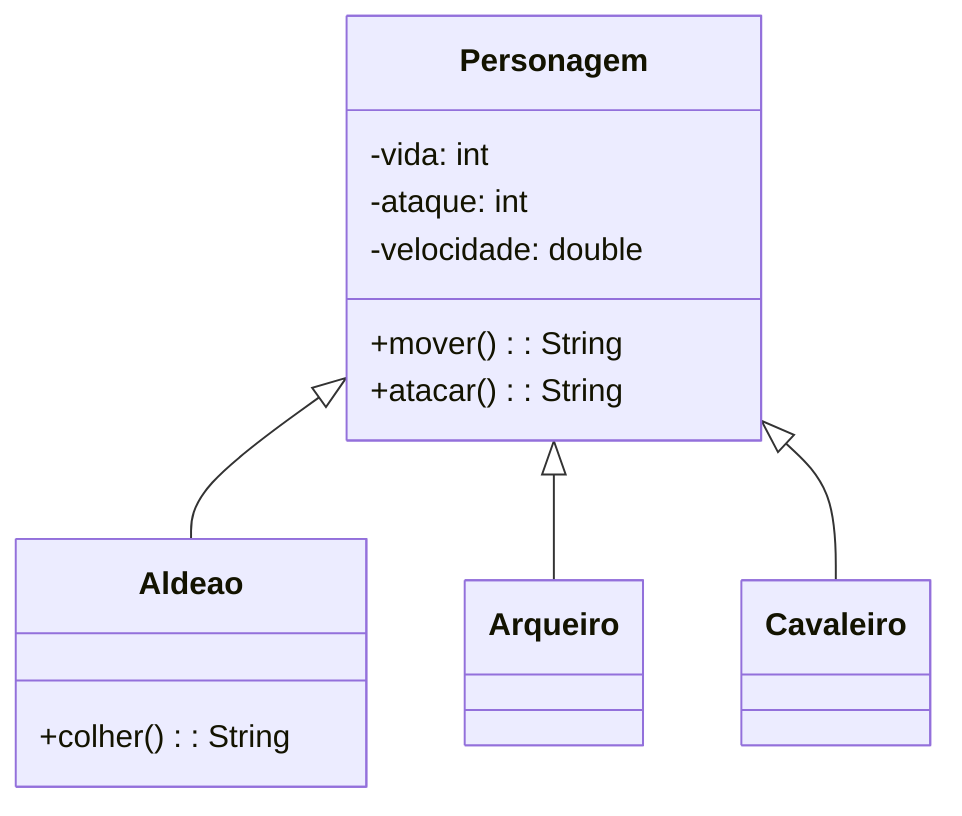

```mermaid
classDiagram
    direction TD
    
    Personagem <|-- Aldeao
    Personagem <|-- Arqueiro
    Personagem <|-- Cavaleiro
    
    
    
    class Personagem{
        -vida: int
        -ataque: int
        -velocidade: double
        +mover(): String
        +atacar(): String
    }
    
    class Aldeao {
        +colher(): String
    }
    
    class Arqueiro {
        
    }
    
    class Cavaleiro {
        
    }
```

